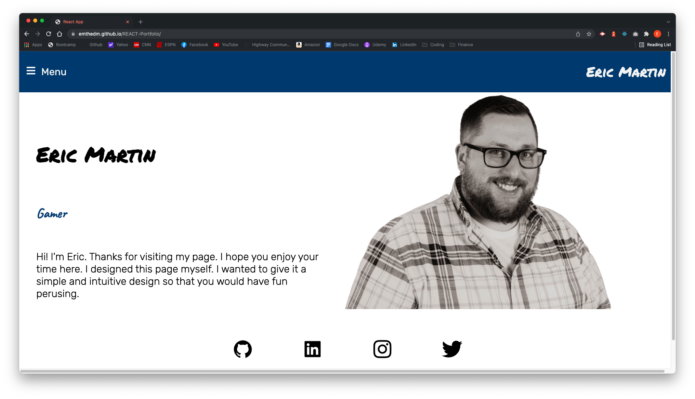
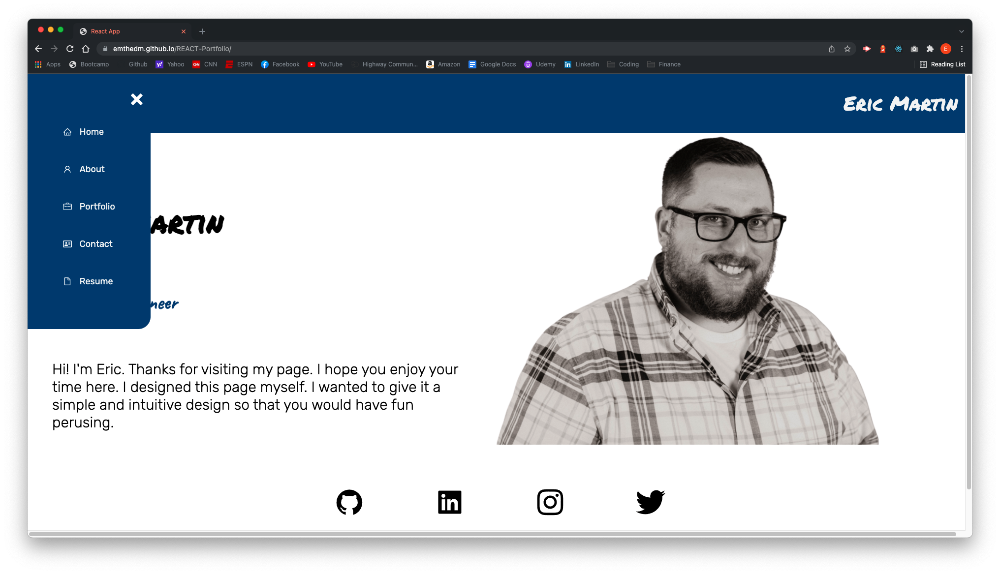
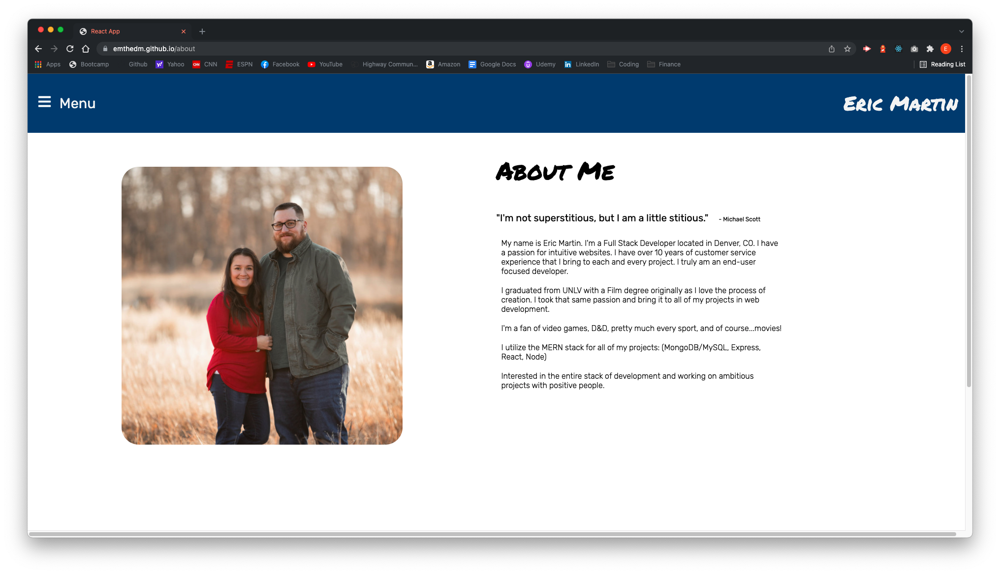
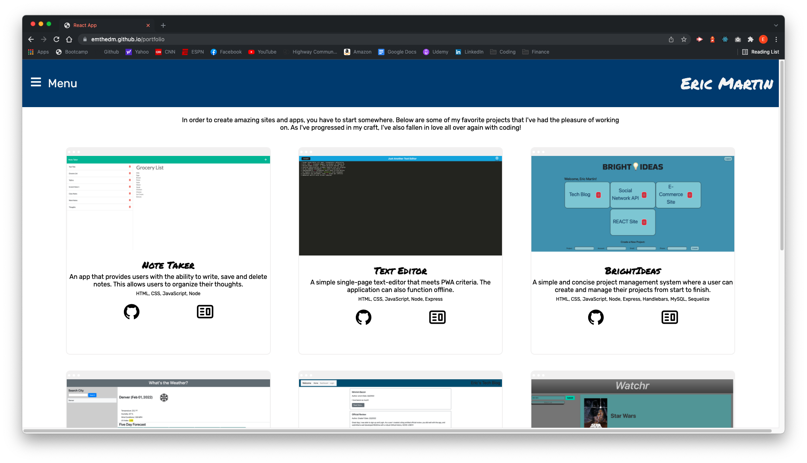
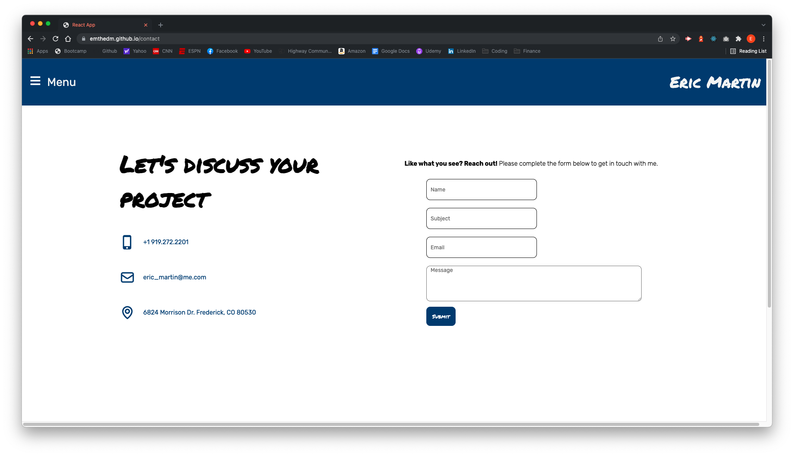
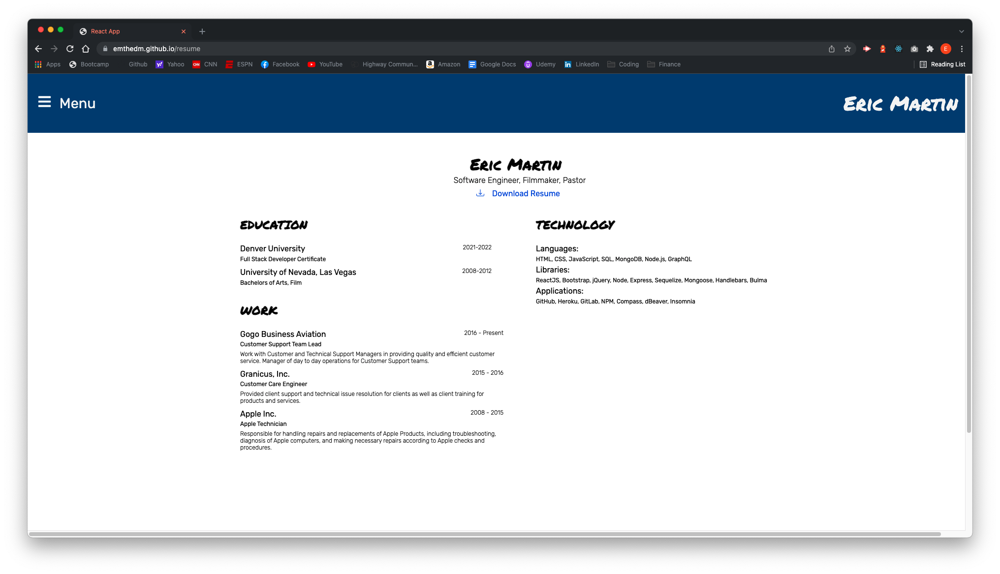

# REACT Portfolio

## Description

Thank you for looking at my portfolio. This portfolio utilizes the ReactJS library to create a single page application. It also utilizes emailJS. A user is able to quickly and intuitively navigate the portfolio to learn more about me, look at my skills and work, as well as contact me by filling out a contact form that uses emailJS.

Visit my portfolio at: [https://emthedm.github.io/REACT-Portfolio/](https://emthedm.github.io/REACT-Portfolio/)

## Table of Contents

- [Usage](#usage)
- [License](#license)
- [Questions](#questions)

## Usage

## License

      This project is licensed under MIT.

      Copyright 2022 Eric Martin

    Permission is hereby granted, free of charge, to any person obtaining a copy of this software and associated documentation files (the "Software"), to deal in the Software without restriction, including without limitation the rights to use, copy, modify, merge, publish, distribute, sublicense, and/or sell copies of the Software, and to permit persons to whom the Software is furnished to do so, subject to the following conditions:

    The above copyright notice and this permission notice shall be included in all copies or substantial portions of the Software.

    THE SOFTWARE IS PROVIDED "AS IS", WITHOUT WARRANTY OF ANY KIND, EXPRESS OR IMPLIED, INCLUDING BUT NOT LIMITED TO THE WARRANTIES OF MERCHANTABILITY, FITNESS FOR A PARTICULAR PURPOSE AND NONINFRINGEMENT. IN NO EVENT SHALL THE AUTHORS OR COPYRIGHT HOLDERS BE LIABLE FOR ANY CLAIM, DAMAGES OR OTHER LIABILITY, WHETHER IN AN ACTION OF CONTRACT, TORT OR OTHERWISE, ARISING FROM, OUT OF OR IN CONNECTION WITH THE SOFTWARE OR THE USE OR OTHER DEALINGS IN THE SOFTWARE.

## Questions

If you would like to connect with me about my REACT Portfolio, please email me at eric_martin@me.com or their gitHub at [EMtheDM](https://github.com/EMtheDM).

## Test
